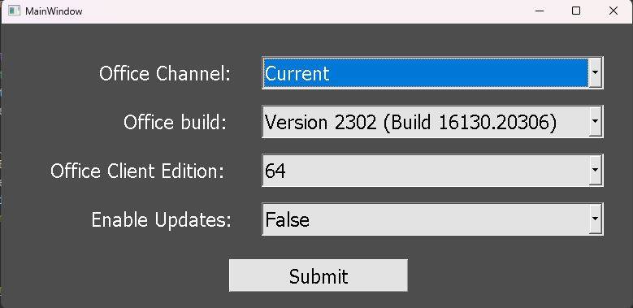

## This application is a user friendly way to change your the following:  
    Office channel
    OfficeClientEdition (bit)
    Specify an exact office version
    enable or disable automatic updates

## How to run the easy way  
**download the compiled code and exe from here:**  https://drive.google.com/file/d/1g0H9Q-KoylrwqsD5q8Q6HHXlNWgz6Vb4/view?usp=sharing 

## How to run the more difficult way (but still pretty easy)  
install the following python package(s):  
1. pyqt5  

### Make sure the following files are in the same folder:  
    main.py
    main.ui
    config.xml
    setup.exe

### Last step
run the main.py python file from an IDE or from command line and voila :)  
   
Leave the build field blank for the latest version. 

